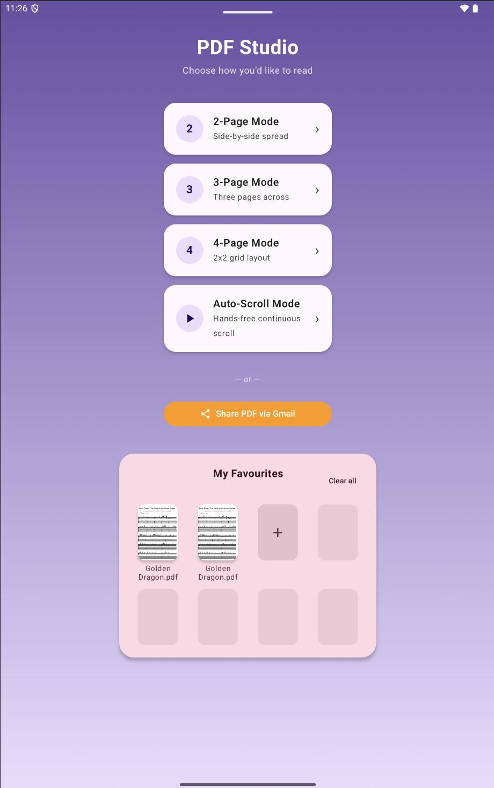
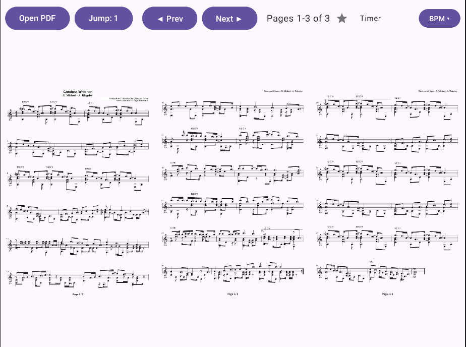
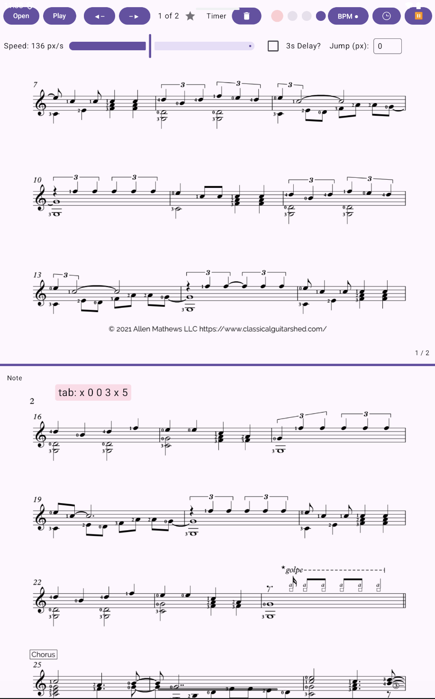

# SheetStand

A digital sheet-music stand for Android — built for musicians who practice or
perform from PDF scores and want their stand to do more than just show a
page.

## Why

Turning pages mid-performance is a pain: you either memorize turns, use a
bulky page-turner pedal, or awkwardly reach for your tablet. And a plain PDF
viewer doesn't know anything about *practicing* — it can't count you in, time
your reps, or scroll for you while your hands stay on the instrument.
SheetStand is a from-scratch answer to that: a stand that scrolls, counts,
and times itself, tuned for practice sessions rather than generic document
reading.

## What it does

- **Multi-page layouts** — view scores as 2, 3, or 4 pages side by side
  (landscape, tuned for tablets), instead of flipping one page at a time.
- **Auto-scroll** — continuous, speed-adjustable scrolling through the score
  so you don't need a hand free to turn pages, with an optional start delay
  and boundary-jump correction to skip page-divider gaps cleanly.
- **Metronome** — on-screen BPM control with tap tempo, configurable time
  signature, a visual beat-light display, and audible clicks — no separate
  app or physical metronome needed.
- **Page timers** — set a per-page duration and the app advances
  automatically after N seconds, with the first page's duration propagating
  as the default for later pages.
- **Session timer** — a simple count-up timer to track how long you've been
  practicing.
- **Favorites** — star PDFs to pin them to a favourites grid on the home
  screen for quick access, with thumbnails.
- **Page notes** — jot a quick note against a specific page (fingering
  reminders, dynamics, anything you'd normally pencil onto paper).
- **Pinch-to-zoom** — zoom into any page for fine detail without losing your
  place.

## Tech

- **Kotlin**
- **Jetpack Compose** for the entire UI — no XML layouts
- Plain Android `Activity` + `mutableStateOf` for state (no ViewModel, no DI)
  — kept intentionally simple for a single-developer practice tool
- PDF rendering via Android's built-in `PdfRenderer`

## Screenshots

| Home screen | 3-page practice view |
|---|---|
|  |  |

| Auto-scroll mode |
|---|
|  |

A short screen recording (10–15s) showing auto-scroll running with the
metronome ticking would also be worth adding here — it's the feature
combination that's hardest to convey in a still image.

## Getting started

Open the project in Android Studio and run the `app` configuration, or from
the command line:

```bash
./gradlew installDebug
```

Minimum SDK 26, target/compile SDK 37.
